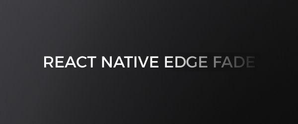

# react-native-edge-fade

> Smooth, native-quality edge fades for React Native. One component. Any view. iOS, Android, Web.

<video src="https://github.com/AmatoGiulio/react-native-edge-fade/raw/main/docs/demo.mp4" autoplay loop muted playsinline style="max-width: 100%;"></video>

[](https://www.npmjs.com/package/react-native-edge-fade)
[](LICENSE)
[](#)

```tsx
import { EdgeFadeView } from 'react-native-edge-fade';

<EdgeFadeView bottom={80} style={{ flex: 1 }}>
  <ScrollView>{/* your content */}</ScrollView>
</EdgeFadeView>
```

## Why?

Building edge fades from scratch means juggling `MaskedView`, `LinearGradient`, platform-specific shaders, and clipping hacks — just to avoid visible banding. This library collapses all of that into a single declarative component with zero extra dependencies.

## Features

- **Three render modes** — mask (alpha dissolve), overlay (color gradient), blur (progressive Gaussian)
- **Four edges, independently tuned** — different size and curve per side; overlay color can also vary per edge
- **True progressive blur** — the blur radius follows the edge curve continuously, with no discrete blur levels (Android API 31+, iOS)
- **Reanimated support** — UI-thread animated fades, no React re-renders
- **RTL-aware** — `start` / `end` props respect layout direction
- **Fabric only** — New Architecture native views, no Paper

## Render modes

```tsx
// Mask — fades content to transparent (reveals what's behind)
<EdgeFadeView bottom={80}>
  <ScrollView>{/* content over an image, gradient, video... */}</ScrollView>
</EdgeFadeView>

// Overlay — paints a color gradient over content
<EdgeFadeView mode="overlay" left={120} right={120} color="#000">
  <ScrollView horizontal>{/* horizontal strip */}</ScrollView>
</EdgeFadeView>

// Blur — progressive blur toward the edge
<EdgeFadeView mode="blur" top={120} blurRadius={24}>
  <ScrollView>{/* nav bar frosting, Apple Music scroll edge */}</ScrollView>
</EdgeFadeView>
```

On Android, `mode="blur"` is a spatial progressive Gaussian: every pixel gets its own radius from the edge curve. API 33+ runs an AGSL port of the AndroidX kernel (no Compose dependency); API 31–32 run an OpenGL ES 3.0 backend with the same radius field. API < 31 and Web fall back to `mask`.

On iOS, `mode="blur"` uses the system `variableBlur` backdrop filter, whose radius follows the edge curve continuously. The filter is not documented by Apple: if it is unavailable, the view falls back automatically to a layered blur built on public `UIVisualEffectView` APIs.

Blur works over images, lists, `WebView` and video rendered into a `TextureView` (for `expo-video`, pass `surfaceType="textureView"`). A `SurfaceView` composites outside the view hierarchy and cannot be blurred by any view-level API: that content is left sharp and a warning is logged. Give the blurred content an opaque background.

## Installation

```sh
yarn add react-native-edge-fade
cd ios && pod install
```

## Usage

```tsx
// Per-edge config: boolean, number, or full object
<EdgeFadeView bottom />                            // enable, 80dp
<EdgeFadeView bottom={120} />                      // custom size
<EdgeFadeView bottom={{ size: 120, curve: 'sharp', color: '#111' }} />

// Vertical list fading at both ends
<EdgeFadeView top={40} bottom={80} style={{ flex: 1 }}>
  <ScrollView>{items.map(i => <Row key={i.id} {...i} />)}</ScrollView>
</EdgeFadeView>

// Progressive blur with a shorter radius ramp
<EdgeFadeView
  mode="blur"
  top={96}
  bottom={112}
  blurRadius={28}
  blurProgression={0.7}
  curve="smooth"
>
  <ScrollView>{/* content */}</ScrollView>
</EdgeFadeView>

// Rounded card
<EdgeFadeView bottom={60} radius={16} style={{ height: 200 }}>
  <Image source={cover} style={StyleSheet.absoluteFill} />
</EdgeFadeView>

// RTL-aware
<EdgeFadeView start={80}>{/* fades leading edge, regardless of direction */}</EdgeFadeView>
```

### Animated (Reanimated)

```tsx
import { AnimatedEdgeFadeView } from 'react-native-edge-fade';
import { useSharedValue } from 'react-native-reanimated';

const scrollY = useSharedValue(0);

<AnimatedEdgeFadeView top={scrollY} bottom={80}>
  <Animated.ScrollView onScroll={...}>{/* content */}</Animated.ScrollView>
</AnimatedEdgeFadeView>
```

Reanimated is optional — without it, use the static `EdgeFadeView`.

## API

### Edge props

`top` `bottom` `left` `right` `start` `end` — each accepts `boolean | number | EdgeConfig`

### Global props

| Prop | Type | Default | Description |
|------|------|---------|-------------|
| `mode` | `'mask' \| 'overlay' \| 'blur'` | auto | Inferred from `color` when omitted |
| `size` | `number` | `80` | Default fade depth (dp) |
| `curve` | `EdgeFadeCurve` | `'smooth'` | Curve shape |
| `color` | `ColorValue` | — | Overlay target color. In `mode="blur"`, an optional veil over the blurred band (transparent inside, the colour at 60% opacity at the outer edge) |
| `radius` | `number` | — | Corner radius |
| `blurRadius` | `number` | `28` | Maximum blur radius (dp) in `mode="blur"` |
| `blurProgression` | `number` | `1` | Fraction of the fade band over which the blur radius reaches its maximum (0.05–1) |

`frostProgression` remains a deprecated compatibility alias for `blurProgression`; the new name wins when both are supplied. `frostSaturation` and `frostLift` are also deprecated compatibility props and are ignored on both platforms — the progressive blur contains no saturation or brightness grading.

### Curves

```tsx
curve="smooth"      // cubic ease-out (default)
curve="smoother"    // S-curve
curve="sharp"       // quintic — aggressive
curve="gentle"      // quadratic — soft
curve="soft"        // sinusoidal — gradual
curve="linear"      // constant rate

// CSS cubic-bezier
{ type: 'cubicBezier', x1: 0.42, y1: 0, x2: 0.58, y2: 1 }

// Custom alpha stops
{ type: 'stops', values: [1, 0.9, 0.6, 0.2, 0] }
```

On Android API 33+, preset curves are evaluated analytically. Serialized `cubicBezier` and `stops` curves are converted into the radius-mask LUT; they still control the continuous Gaussian radius rather than blending between discrete blur levels.

## License

MIT © [Giulio Amato](https://github.com/AmatoGiulio)
